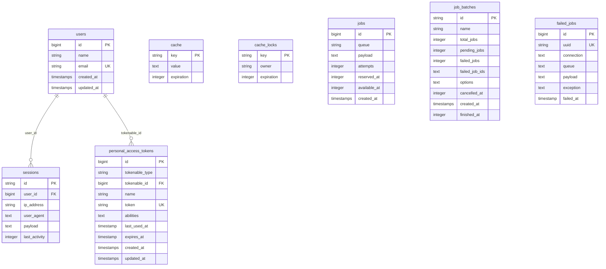

# Complete Database ERD - Entity Relationship Diagrams

## 🗄️ Complete System Database ERD

```mermaid
erDiagram
    %% UserManagement Module Tables
    users ||--o| admins : "user_id"
    users ||--o| staff : "user_id"
    users ||--o| customers : "user_id"
    users ||--o{ email_verification_otps : "user_id"
    admins ||--o{ admin_permissions : "admin_id"
    admin_permissions }o--|| permissions : "permission_id"
    
    %% ServiceManagement Module Tables
    space_types ||--o{ spaces : "space_type_id"
    space_types ||--o{ customers : "space_type_id"
    spaces ||--o{ services : "space_id"
    users ||--o{ services : "user_id"
    
    %% ReservationManagement Module Tables
    users ||--o{ reservations : "user_id"
    spaces }o--o{ reservations : "space_id"
    space_types }o--o{ reservations : "space_type_id"
    
    %% BillingPayment Module Tables
    users ||--o{ transaction_logs : "user_id"
    
    %% RefundManagement Module Tables
    reservations ||--o{ refunds : "reservation_id"
    users ||--o{ refunds : "processed_by"
    
    %% System Core Tables
    users ||--o{ sessions : "user_id"
    users ||--o{ personal_access_tokens : "tokenable_id"
    
    users {
        bigint id PK
        string name
        string email UK
        timestamp email_verified_at
        string password
        string phone
        string google_id
        string avatar
        boolean is_active
        string remember_token
        timestamps created_at
        timestamps updated_at
    }
    
    admins {
        bigint id PK
        bigint user_id FK UK
        boolean is_super_admin
        timestamps created_at
        timestamps updated_at
    }
    
    staff {
        bigint id PK
        bigint user_id FK UK
        string department
        timestamps created_at
        timestamps updated_at
    }
    
    customers {
        bigint id PK
        bigint user_id FK UK
        bigint space_type_id FK
        string name
        string company_name
        string contact_person
        timestamps created_at
        timestamps updated_at
    }
    
    permissions {
        bigint id PK
        string name UK
        string description
        timestamps created_at
        timestamps updated_at
    }
    
    admin_permissions {
        bigint id PK
        bigint admin_id FK
        bigint permission_id FK
        timestamps created_at
        timestamps updated_at
    }
    
    email_verification_otps {
        bigint id PK
        bigint user_id FK
        string otp
        timestamp expires_at
        timestamps created_at
        timestamps updated_at
    }
    
    space_types {
        bigint id PK
        string name UK
        decimal hourly_rate
        decimal daily_rate
        string pricing_type
        text description
        string image_path
        string photo_path
        timestamps created_at
        timestamps updated_at
    }
    
    spaces {
        bigint id PK
        bigint space_type_id FK
        string name
        integer capacity
        decimal hourly_rate
        decimal daily_rate
        text description
        boolean is_available
        timestamps created_at
        timestamps updated_at
    }
    
    services {
        bigint id PK
        bigint user_id FK
        bigint space_id FK
        string name
        decimal hourly_rate
        text description
        boolean is_available
        timestamps created_at
        timestamps updated_at
    }
    
    reservations {
        bigint id PK
        bigint user_id FK
        bigint space_id FK
        bigint space_type_id FK
        string customer_name
        string customer_email
        string customer_phone
        string company_name
        datetime start_time
        datetime end_time
        integer hours
        integer pax
        decimal total_cost
        decimal custom_hourly_rate
        decimal applied_pricing
        decimal amount_paid
        decimal amount_remaining
        boolean is_open_time
        boolean is_discounted
        string status
        string payment_status
        string payment_method
        string wifi_ssid
        string wifi_password
        text notes
        timestamps created_at
        timestamps updated_at
    }
    
    transaction_logs {
        bigint id PK
        bigint user_id FK
        string action
        string model_type
        bigint model_id
        json old_values
        json new_values
        string ip_address
        text user_agent
        text description
        timestamps created_at
        timestamps updated_at
    }
    
    refunds {
        bigint id PK
        bigint reservation_id FK
        bigint processed_by FK
        decimal refund_amount
        string refund_reason
        string refund_status
        string refund_method
        datetime requested_at
        datetime processed_at
        text admin_notes
        timestamps created_at
        timestamps updated_at
    }
    
    sessions {
        string id PK
        bigint user_id FK
        string ip_address
        text user_agent
        text payload
        integer last_activity
    }
    
    personal_access_tokens {
        bigint id PK
        string tokenable_type
        bigint tokenable_id FK
        string name
        string token UK
        text abilities
        timestamp last_used_at
        timestamp expires_at
        timestamps created_at
        timestamps updated_at
    }
    
    cache {
        string key PK
        text value
        integer expiration
    }
    
    cache_locks {
        string key PK
        string owner
        integer expiration
    }
    
    jobs {
        bigint id PK
        string queue
        text payload
        integer attempts
        integer reserved_at
        integer available_at
        timestamps created_at
    }
    
    job_batches {
        string id PK
        string name
        integer total_jobs
        integer pending_jobs
        integer failed_jobs
        text failed_job_ids
        text options
        integer cancelled_at
        timestamps created_at
        integer finished_at
    }
    
    failed_jobs {
        bigint id PK
        string uuid UK
        text connection
        text queue
        text payload
        text exception
        timestamp failed_at
    }
```

---

## 1️⃣ UserManagement Module Database ERD

```mermaid
erDiagram
    users ||--o| admins : "user_id"
    users ||--o| staff : "user_id"
    users ||--o| customers : "user_id"
    users ||--o{ email_verification_otps : "user_id"
    admins ||--o{ admin_permissions : "admin_id"
    admin_permissions }o--|| permissions : "permission_id"
    
    users {
        bigint id PK
        string name
        string email UK
        timestamp email_verified_at
        string password
        string phone
        string google_id
        string avatar
        boolean is_active
        string remember_token
        timestamps created_at
        timestamps updated_at
    }
    
    admins {
        bigint id PK
        bigint user_id FK UK
        boolean is_super_admin
        timestamps created_at
        timestamps updated_at
    }
    
    staff {
        bigint id PK
        bigint user_id FK UK
        string department
        timestamps created_at
        timestamps updated_at
    }
    
    customers {
        bigint id PK
        bigint user_id FK UK
        bigint space_type_id FK
        string name
        string company_name
        string contact_person
        timestamps created_at
        timestamps updated_at
    }
    
    permissions {
        bigint id PK
        string name UK
        string description
        timestamps created_at
        timestamps updated_at
    }
    
    admin_permissions {
        bigint id PK
        bigint admin_id FK
        bigint permission_id FK
        timestamps created_at
        timestamps updated_at
    }
    
    email_verification_otps {
        bigint id PK
        bigint user_id FK
        string otp
        timestamp expires_at
        timestamps created_at
        timestamps updated_at
    }
```

**Tables**: 7 (users, admins, staff, customers, permissions, admin_permissions, email_verification_otps)

**Key Features**:
- One user can have multiple roles (admin, staff, customer simultaneously)
- Admin permissions are granular and customizable
- Google OAuth integration via `google_id` field
- Email verification with OTP system
- User activation/deactivation control via `is_active`

---

## 2️⃣ ServiceManagement Module Database ERD


**Tables**: 3 (space_types, spaces, services)  
**External Reference**: users (from UserManagement)

**Key Features**:
- Hierarchical structure: Space Types → Spaces → Services
- Flexible pricing: hourly, daily, or both
- Can override rates at each level
- Space availability management
- Image/photo support for space types
- Capacity tracking per space

---

## 3️⃣ ReservationManagement Module Database ERD


**Tables**: 1 (reservations)  
**External References**: users (UserManagement), spaces, space_types (ServiceManagement)

**Key Features**:
- Flexible booking: specific space OR space type
- Walk-in customer support (without user account)
- Open-time booking (no fixed end time) via `is_open_time`
- Partial payment tracking
- Automatic WiFi credential generation
- Multiple payment methods (gcash, maya, cash)
- Custom hourly rate override
- Discount system via `is_discounted`
- Status workflow: pending → confirmed → completed/cancelled

---

## 4️⃣ CalendarView Module Database ERD

```mermaid
erDiagram
    %% NO TABLES - This module has NO database tables
    %% It only reads from other modules
```

**Tables**: 0  
**Note**: CalendarView is a presentation module with no database tables. It reads from ReservationManagement and ServiceManagement modules to display data in calendar format using FullCalendar library.

---

## 5️⃣ TimeManagement Module Database ERD


**Tables**: 0  
**Note**: TimeManagement uses the `reservations` table from ReservationManagement module. It tracks time through the `is_open_time`, `start_time`, `end_time`, and `hours` fields. Timer state is stored in localStorage for PWA offline support.

---

## 6️⃣ CustomerBooking Module Database ERD


**Tables**: 0  
**Note**: CustomerBooking is a public-facing interface module with no authentication required. It creates records in the `reservations` table from ReservationManagement module for walk-in customers.

---

## 7️⃣ BillingPayment Module Database ERD


**Tables**: 1 (transaction_logs)  
**External Reference**: users (UserManagement)

**Key Features**:
- Complete audit trail for all operations
- Tracks all CRUD operations
- Payment processing logs
- User action tracking
- IP and user agent logging
- JSON diff (old vs new values)
- Polymorphic relationship via `model_type` and `model_id`
- Searchable and filterable

---

## 8️⃣ RefundManagement Module Database ERD

```mermaid
erDiagram
    reservations ||--o{ refunds : "reservation_id"
    users ||--o{ refunds : "processed_by"
    
    refunds {
        bigint id PK
        bigint reservation_id FK UK
        bigint processed_by FK
        decimal refund_amount
        string refund_reason
        string refund_status
        string refund_method
        datetime requested_at
        datetime processed_at
        text admin_notes
        timestamps created_at
        timestamps updated_at
    }
    
    reservations {
        bigint id PK
        bigint user_id FK
        decimal total_cost
        string status
        timestamps created_at
        timestamps updated_at
    }
    
    users {
        bigint id PK
        string name
        string email UK
        timestamps created_at
        timestamps updated_at
    }
```

**Tables**: 1 (refunds)  
**External References**: reservations (ReservationManagement), users (UserManagement)

**Key Features**:
- One refund per reservation maximum (UK constraint)
- Workflow: requested → approved/rejected → processed
- Tracks processing admin via `processed_by`
- Admin notes for internal communication
- Refund method matches original payment
- Full audit trail via transaction_logs module

---

## 9️⃣ WiFiCredentials Module Database ERD


**Tables**: 0  
**Note**: WiFiCredentials module generates and manages WiFi credentials stored in the `wifi_ssid` and `wifi_password` fields of the `reservations` table from ReservationManagement module.

**Key Features**:
- Auto-generated on booking confirmation
- Format: SSID = `COZ_GUEST_{reservation_id}`
- Format: Password = `space{reservation_id}{year}`
- Displayed on confirmation page
- Copy-to-clipboard functionality
- PWA offline storage support
- Expires when reservation ends

---

## ⚙️ System Core Database ERD



**Tables**: 7 (sessions, personal_access_tokens, cache, cache_locks, jobs, job_batches, failed_jobs)

**Key Features**:
- **sessions**: Active user sessions with device tracking
- **personal_access_tokens**: Laravel Sanctum API authentication tokens
- **cache**: Application-level caching
- **cache_locks**: Distributed lock mechanism
- **jobs**: Queue system for background tasks
- **job_batches**: Batch job tracking
- **failed_jobs**: Failed queue job logging

---

## 📊 Summary by Module

| Module | Tables | Table Names |
|--------|--------|-------------|
| **UserManagement** | 7 | users, admins, staff, customers, permissions, admin_permissions, email_verification_otps |
| **ServiceManagement** | 3 | space_types, spaces, services |
| **ReservationManagement** | 1 | reservations |
| **CalendarView** | 0 | _(reads from other modules)_ |
| **TimeManagement** | 0 | _(uses reservations table)_ |
| **CustomerBooking** | 0 | _(creates in reservations table)_ |
| **BillingPayment** | 1 | transaction_logs |
| **RefundManagement** | 1 | refunds |
| **WiFiCredentials** | 0 | _(uses reservations table)_ |
| **System Core** | 7 | sessions, personal_access_tokens, cache, cache_locks, jobs, job_batches, failed_jobs |
| **TOTAL** | **20** | **20 database tables** |

---

## 🔗 Cross-Module Relationships

| From Module | To Module | Relationship | Foreign Key |
|-------------|-----------|--------------|-------------|
| UserManagement | ServiceManagement | users → services | `services.user_id` |
| UserManagement | ReservationManagement | users → reservations | `reservations.user_id` |
| UserManagement | BillingPayment | users → transaction_logs | `transaction_logs.user_id` |
| UserManagement | RefundManagement | users → refunds | `refunds.processed_by` |
| ServiceManagement | UserManagement | customers → space_types | `customers.space_type_id` |
| ServiceManagement | ReservationManagement | spaces → reservations | `reservations.space_id` |
| ServiceManagement | ReservationManagement | space_types → reservations | `reservations.space_type_id` |
| ReservationManagement | RefundManagement | reservations → refunds | `refunds.reservation_id` |

---

## 📈 Database Statistics

- **Total Tables**: 20
- **Total Foreign Keys**: 15
- **Total Unique Constraints**: 8
- **Modules with Tables**: 5 out of 9
- **Presentation-Only Modules**: 4 (CalendarView, TimeManagement, CustomerBooking, WiFiCredentials)

---

## 🎯 Key Design Decisions

1. **Multi-Role System**: Users can have multiple roles simultaneously (admin + staff + customer)
2. **Flexible Reservations**: Can book by specific space OR space type
3. **WiFi Integration**: Credentials stored directly in reservations for simplicity
4. **Audit Trail**: Complete transaction logging via transaction_logs
5. **Payment Tracking**: Partial payments supported with remaining balance tracking
6. **Refund Workflow**: Status-based refund processing with admin oversight
7. **Open-Time Bookings**: Support for indefinite end times
8. **Polymorphic Logging**: transaction_logs can track any model type
9. **Pricing Flexibility**: Rates can be overridden at space_type, space, service, or reservation level
10. **Session Management**: Laravel's built-in session system with Sanctum API tokens

---

**Generated**: November 13, 2025  
**System**: Coworking Space Management System  
**Architecture**: Modular Laravel Application with 9 Functional Modules
